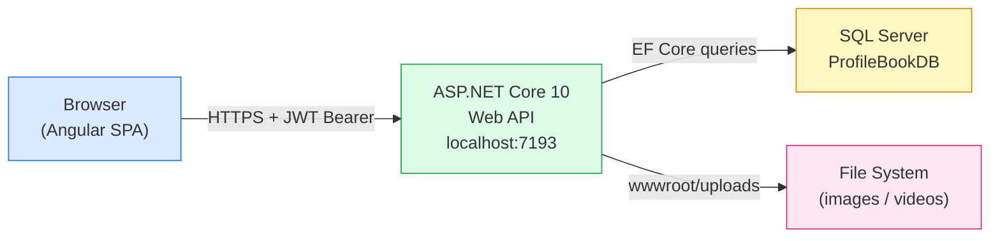
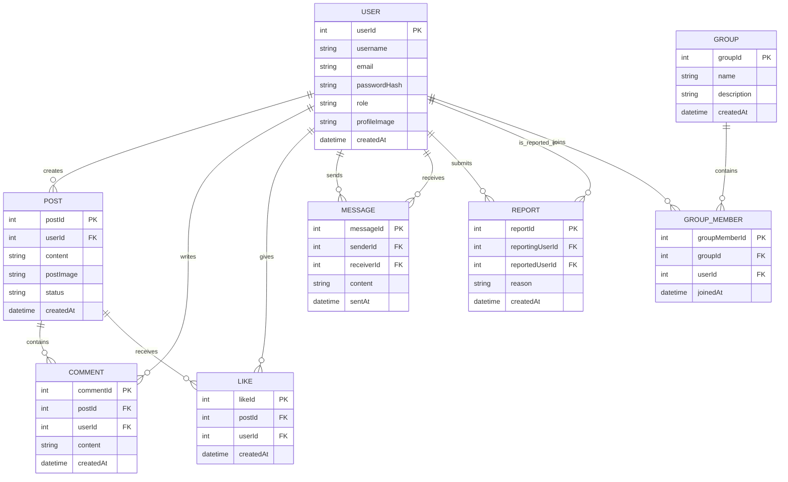

# 📖 ProfileBook — Final Report
### A Full-Stack Social Networking Platform · *Connect. Share. Belong.*

---

| | |
|---|---|
| **Submitted By** | Ketan Kumar |
| **Batch** | WIPRO NGA – .Net Full Stack Angular – FY26 |
| **Instructor** | Mr. Ramesh Nediyadath |
| **Submission** | Sprint 2 – March 25, 2026 |
| **GitHub** | [github.com/Kincaid2800/ProfileBook](https://github.com/Kincaid2800/ProfileBook) |
| **Tech Stack** | Angular 21 · ASP.NET Core 10 · SQL Server |

---

## Table of Contents

1. [Problem Definition and Objectives](#1-problem-definition-and-objectives)
2. [Frontend & Backend Architecture](#2-frontend--backend-architecture)
   - 2.1 [Technology Stack](#21-technology-stack)
   - 2.2 [System Architecture Overview](#22-system-architecture-overview)
   - 2.3 [Authentication Flow](#23-authentication-flow)
3. [Component Breakdown & API Design](#3-component-breakdown--api-design)
   - 3.1 [Angular Component Overview](#31-angular-component-overview)
   - 3.2 [Custom Directives & Pipes](#32-custom-directives--pipes)
   - 3.3 [ViewEncapsulation](#33-viewencapsulation--all-three-modes)
   - 3.4 [Route Guards](#34-route-guards--session-handling)
   - 3.5 [API Endpoint Reference](#35-api-endpoint-reference)
4. [Database Design & Storage Optimization](#4-database-design--storage-optimization)
   - 4.1 [Entity-Relationship Diagram](#41-entity-relationship-diagram)
   - 4.2 [Table Definitions](#42-table-definitions)
   - 4.3 [Design & Optimization Notes](#43-design--optimization-notes)
5. [Testing](#5-testing)
6. [Key Features Summary](#6-key-features-summary)

---

## 1. Problem Definition and Objectives

The idea behind ProfileBook started from a simple observation: most internal communication tools either do too much or too little. Heavy enterprise platforms like Teams or Slack are great for work chat, but they're not designed for community-style interaction — sharing a post, reacting to it, forming interest groups, or having a moderated feed that someone actually curates. At the same time, public social networks like Instagram or Twitter are too open and too noisy for a focused academic or organizational community.

ProfileBook is my attempt to build something in between — a lightweight social platform where members can express themselves through posts, connect through private messages, join topic-based groups, and trust that the content they see has been reviewed. It's built as a full-stack application with a clear separation between what a regular user can do and what an admin controls.

### Project Objectives

- Build a two-role system (User and Admin) where each role has a clearly defined set of capabilities.
- Enable post creation with text and optional media (images/videos), subject to admin approval before appearing in the feed — so the content environment stays clean.
- Provide a private messaging system between any two users, with a conversation sidebar that shows recent chats and message previews.
- Support community groups — users can browse and join; admins can create and remove them.
- Give users the ability to interact with posts through likes and comments in a way that feels instant, even before the server responds (optimistic UI).
- Secure every authenticated endpoint with JWT Bearer tokens, and protect every Angular route with functional guards so unauthenticated users are redirected — not just blocked at the API level.
- Make the codebase demonstrate real Angular concepts: standalone components, custom pipes, custom directives, all three ViewEncapsulation modes, and testable services.

> ✅ The project is fully functional end-to-end — registration, login, posting, messaging, grouping, and admin moderation all work through the live API at `https://localhost:7193`.

---

## 2. Frontend & Backend Architecture

### 2.1 Technology Stack

| Layer | Technology | Why This Choice |
|---|---|---|
| Frontend Framework | Angular 21 + TypeScript 5.9 | Standalone component model, strong typing, and a well-structured opinionated framework suited for a multi-page SPA with routing and DI. |
| UI Styling | Bootstrap 5.3 + Custom CSS | Bootstrap provides the responsive grid and base components. Every component has its own scoped CSS file for layout and visual identity. |
| HTTP Client | Axios 1.13 | Axios has cleaner promise-based syntax than Angular's HttpClient for this project, and it was already familiar from prior work. |
| Backend Framework | ASP.NET Core 10 Web API | Minimal API surface, attribute-based routing, built-in JWT middleware, and EF Core integration make it a natural fit for a REST API backend. |
| ORM | Entity Framework Core 10 | Code-first migrations mean the database schema evolves with the models — no raw SQL needed for schema management during development. |
| Database | SQL Server (SSMS / LocalDB) | Relational model fits the data well — users, posts, comments, likes, and messages all have clear foreign key relationships. |
| Authentication | JWT Bearer Tokens + BCrypt | Stateless auth via JWT means the API doesn't need session storage. BCrypt handles password hashing with a configurable cost factor. |
| Testing | Vitest 4.0 + Angular TestBed | Vitest is faster than Jest and integrates well with the Vite build pipeline. Angular TestBed enables realistic component testing with DI. |

### 2.2 System Architecture Overview

ProfileBook follows a standard client-server architecture. The Angular SPA runs entirely in the browser and communicates with the ASP.NET Core Web API over HTTPS. There is no server-side rendering — the frontend is a pure single-page application where Angular's router handles all navigation.

The frontend never talks directly to the database. All data access goes through the REST API. File uploads (post images, profile pictures) are stored in `wwwroot/uploads` and `wwwroot/profiles` on the server and served as static files — the Angular app receives a URL path and renders the file using a standard `` or `<video>` tag.

### 2.3 Authentication Flow

Authentication is fully stateless. When a user logs in, the API validates their credentials using BCrypt, generates a JWT token containing their user ID, username, and role as claims, and returns it in the response. Angular's `AuthService` stores the token, username, and role in `localStorage` — which means the session persists across browser refreshes without any server-side session management.

Every subsequent API call that requires authentication sends the token as a Bearer header: `Authorization: Bearer <token>`. The backend's `[Authorize]` attribute and ASP.NET Core's JWT middleware validate the token on every request. Admin-only endpoints additionally check `[Authorize(Roles = "Admin")]` against the role claim embedded in the token.

On the frontend side, Angular route guards (`authGuard` and `adminGuard`) check `localStorage` before any protected route renders — if no token is present, the user is redirected to `/login` before the component even initialises. JWT tokens are configured to expire after 7 days.

> **Security note:** Storing JWT in localStorage is a deliberate trade-off here. It's simpler to implement than HttpOnly cookies and sufficient for an academic project. A production deployment would use HttpOnly cookies with CSRF protection instead.

---

## 3. Component Breakdown & API Design

### 3.1 Angular Component Overview

The frontend is built entirely with Angular's standalone component model — there are no NgModules. Every component declares its own `imports` array, including the directives and pipes it uses. Dependency injection uses Angular's `inject()` function rather than constructor injection, which is the recommended pattern for standalone components.

| Component | Route | Guard | Responsibility |
|---|---|---|---|
| `LoginComponent` | /login | None | Email/password form, client-side validation, role-based redirect (Admin → /admin, User → /home). API errors shown as toasts; validation errors shown inline. |
| `RegisterComponent` | /register | None | Three-field signup form (username, email, password). Validates all fields before hitting the API, then redirects to /login after a 2-second success toast. |
| `HomeComponent` | /home | authGuard | Main feed — create posts with media, like/unlike, comment, delete own posts. Optimistic UI on likes and comments. Character counter (500 char limit) on post textarea. |
| `ProfileComponent` | /profile | authGuard | Displays user info, allows profile picture upload via multipart form. Uses `ChangeDetectorRef` to force re-render after the async image URL update. |
| `MessagesComponent` | /messages | authGuard | DM system. Shows recent conversations in a sidebar (cached in localStorage), opens a chat panel on user selection. Auto-refreshes every 8 seconds and on window focus. |
| `SearchComponent` | /search | authGuard | Search users by username, view their profile, report them, or navigate to message them directly. Search input gets autofocus on page load. |
| `GroupsComponent` | /groups | authGuard | Browse all groups, join/leave with an optimistic toggle. Groups cached in localStorage as fallback. Auto-refreshes every 10 seconds. |
| `AdminComponent` | /admin | adminGuard | Tab-based dashboard — pending posts (approve), user management (view/edit/delete), group management (create/delete), reports review. All actions use typed toasts for feedback. |

### 3.2 Custom Directives & Pipes

One of the deliberate goals of this sprint was to move repeated DOM behaviour into reusable directives rather than duplicating logic across components. Three custom directives were built:

| Directive / Pipe | Selector | What It Does & Why |
|---|---|---|
| **AutofocusDirective** | `appAutofocus` | Implements `AfterViewInit` and calls `nativeElement.focus()` inside a `setTimeout(0)`. The timeout is necessary because Angular's SPA router doesn't trigger a full page reload — native HTML `autofocus` only fires on initial browser load, not on route changes. Used on: login email, register username, search input. |
| **TrimInputDirective** | `appTrimInput` | Listens to the `blur` event via `@HostListener`. On blur, trims leading/trailing whitespace and dispatches a native `input` event to sync Angular's `ngModel`. Deliberately not applied to password fields — silently trimming a password could break logins for users who intentionally use spaces. |
| **PasswordToggleDirective** | `appPasswordToggle` | Uses `Renderer2` (Angular's platform-safe DOM API) to wrap the password input in a relative-positioned container and inject an SVG eye-icon button. Clicking the button swaps `type="password"` ↔ `type="text"` and flips the icon. `Renderer2` was chosen over direct DOM manipulation because it works in SSR and Web Worker environments. |
| **TimeAgoPipe** | `timeAgo` | A standalone `@Pipe` that converts ISO date strings into relative labels like "just now", "5 mins ago", "yesterday", "3 weeks ago". Uses `Math.floor` so times always round down. Handles `null`, `undefined`, and invalid dates gracefully. Used in: post timestamps on the feed, conversation list in messages, group creation dates. |

### 3.3 ViewEncapsulation — All Three Modes

In a plain HTML website, all CSS is global. In an Angular SPA where multiple components render simultaneously, global CSS causes style collisions. ViewEncapsulation is Angular's solution. ProfileBook deliberately demonstrates all three available modes:

| Component | Mode | Reasoning |
|---|---|---|
| `HomeComponent` | **Emulated** | Default mode, explicitly set to document the decision. Angular rewrites CSS rules to include a unique attribute selector (e.g. `.avatar[_ngcontent-xyz]`) so HomeComponent's styles cannot affect MessagesComponent or GroupsComponent, which use similar class names like `.card` and `.avatar`. |
| `ToastComponent` | **None** | Toast is a global overlay — `position: fixed`, `z-index: 9999`, anchored to the viewport. Its styles are global by design. Using `None` injects the CSS into the document `<head>` without any attribute scoping. |
| `AvatarComponent` | **ShadowDom** | A self-contained letter-avatar component. The browser creates a hard style boundary: Bootstrap and any parent CSS cannot reach inside this component. The avatar looks identical everywhere it appears. Uses `:host` to style the outer element from within the Shadow DOM. |

### 3.4 Route Guards — Session Handling

Two functional guards protect the application's routes using Angular's `CanActivateFn` type:

- **`authGuard`** — checks `AuthService.isLoggedIn()` (reads `localStorage` for a JWT token). If no token exists, returns `router.createUrlTree(['/login'])`. A `UrlTree` return is preferred over `router.navigate() + false` because Angular cancels the original navigation atomically, preventing a brief flash of the protected route.

- **`adminGuard`** — first checks `isLoggedIn()`, then checks `isAdmin()`. A logged-in regular user who navigates to `/admin` is redirected to `/home` rather than `/login` — because they are authenticated, just not authorised.

> ⚠️ Before adding these guards, any user who knew the URL could navigate directly to `/home` or `/admin` without logging in. The API would reject data requests, but the page shell would still render. Guards close this gap at the routing layer.

### 3.5 API Endpoint Reference

#### Auth Controller

| Method | Endpoint | Auth | Description |
|---|---|---|---|
| POST | `/api/Auth/register` | None | Creates a new user account. Checks for duplicate email, hashes password with BCrypt before storing. |
| POST | `/api/Auth/login` | None | Validates credentials, returns `{token, username, role}`. JWT expires in 7 days. |

#### User Controller

| Method | Endpoint | Auth | Description |
|---|---|---|---|
| GET | `/api/User` | Admin | Returns all registered users. |
| GET | `/api/User/profile` | Bearer | Returns the authenticated user's own profile (extracts userId from JWT claims). |
| GET | `/api/User/search?username=` | Bearer | Partial username search using `.Contains()`. |
| GET | `/api/User/{id}` | Bearer | Returns a single user's public profile by ID. |
| PUT | `/api/User/{id}` | Admin | Updates username and email. |
| DELETE | `/api/User/{id}` | Admin | Deletes user and cascades removal of their posts, likes, comments, messages, and reports. |
| POST | `/api/User/report` | Bearer | Submits a misconduct report against another user. |
| GET | `/api/User/reports` | Admin | Returns all submitted reports. |
| POST | `/api/User/upload-profile-picture` | Bearer | Saves profile image to `wwwroot/profiles/`, updates user record. |

#### Post Controller

| Method | Endpoint | Auth | Description |
|---|---|---|---|
| GET | `/api/Post` | None | Returns all Approved posts with likes and comments, newest first. |
| POST | `/api/Post` | Bearer | Creates a post with `status = "Pending"` — requires admin approval before appearing in feed. |
| DELETE | `/api/Post/{id}` | Bearer | Deletes own post. Ownership enforced via JWT userId claim. |
| POST | `/api/Post/{id}/like` | Bearer | Toggles like — adds if not liked, removes if already liked. |
| POST | `/api/Post/{id}/comment` | Bearer | Adds a comment to a post. |
| GET | `/api/Post/pending` | Admin | Returns posts awaiting admin approval. |
| PUT | `/api/Post/{id}/approve` | Admin | Sets post status to "Approved". |
| POST | `/api/Post/upload` | Bearer | Accepts multipart file upload (image/video), saves to `wwwroot/uploads/` with a GUID filename. |

#### Message Controller

| Method | Endpoint | Auth | Description |
|---|---|---|---|
| GET | `/api/Message` | Bearer | Returns all messages sent to or received by the current user. |
| POST | `/api/Message` | Bearer | Sends a message to another user by userId. |

#### Group Controller

| Method | Endpoint | Auth | Description |
|---|---|---|---|
| GET | `/api/Group` | Bearer | Returns all groups with member count and current user's membership status. |
| POST | `/api/Group` | Admin | Creates a new group. |
| POST | `/api/Group/{id}/join` | Bearer | Toggles membership — joins or leaves. |
| DELETE | `/api/Group/{id}` | Admin | Deletes a group and all its membership records. |

---

## 4. Database Design & Storage Optimization

### 4.1 Entity-Relationship Diagram

The database has 8 tables, managed through Entity Framework Core code-first migrations. The schema went through 3 migration versions during development: `InitialCreate` → `AddGroups` → `AddProfileImage`.

### 4.2 Table Definitions

| Table | Key Fields | Purpose |
|---|---|---|
| **Users** | `userId` PK, `email` (unique), `role` | Core identity table. Role field drives both API authorization and Angular route guard logic. |
| **Posts** | `postId` PK, `userId` FK, `status` | Content table. The `status` field ("Pending" / "Approved") implements the moderation workflow without needing a separate approval table. |
| **Comments** | `commentId` PK, `postId` FK, `userId` FK | Text responses to posts. Two FK relationships link each comment to both its author and its parent post. |
| **Likes** | `likeId` PK, `postId` FK, `userId` FK | Reaction table. The toggle-like endpoint checks for existence of a (postId, userId) pair to decide whether to add or remove. |
| **Messages** | `messageId` PK, `senderId` FK → Users, `receiverId` FK → Users | DM table. Two foreign keys to the same Users table represent sender and receiver. API filters by `senderId OR receiverId = currentUserId`. |
| **Reports** | `reportId` PK, `reportingUserId` FK, `reportedUserId` FK | Abuse reporting. Two FK references to Users distinguish the reporter from the reported party. |
| **Groups** | `groupId` PK, `name`, `description` | Community groups created by admins. Membership tracked separately in GroupMembers. |
| **GroupMembers** | `groupMemberId` PK, `groupId` FK, `userId` FK | Junction table for the many-to-many relationship between Users and Groups. Includes `joinedAt` timestamp. |

### 4.3 Design & Optimization Notes

- **Cascade deletes in code, not in database:** When an admin deletes a user, `UserController.DeleteUser` manually removes that user's posts, likes, comments, messages, and reports before deleting the user record. This is done explicitly in C# rather than relying on database CASCADE DELETE — making the behaviour visible, predictable, and easy to adjust.

- **Status-based moderation (no soft delete):** Posts use a `status` string field ("Pending" / "Approved") rather than an `isDeleted` flag. This keeps the schema simple — the feed query just filters `WHERE status = 'Approved'`, and pending posts remain visible to the admin for review.

- **Explicit `.Include()` over lazy loading:** All feed queries use `.Include(p => p.User)`, `.Include(p => p.Comments).ThenInclude(c => c.User)`, and `.Include(p => p.Likes)`. Lazy loading is disabled to prevent N+1 query problems — a single LINQ query produces one SQL SELECT with JOINs rather than one query per post.

- **GUID filenames on uploads:** Uploaded files are saved as `{Guid.NewGuid()}{extension}`. This prevents filename collisions between users and makes it impossible to guess or enumerate other users' files by filename.

- **BCrypt cost factor:** Passwords are hashed with BCrypt using its default cost factor (11). This makes each hash computation intentionally slow — fast enough for a login, slow enough to make brute-force attacks infeasible even if the database is compromised.

- **localStorage caching on the frontend:** Groups and recent message conversations are cached in localStorage so the UI can render immediately on page load while the API call is in flight. The cache is refreshed on every successful API response and used as a fallback if the API fails.

---

## 5. Testing

Tests are written using Vitest with Angular TestBed, organized into unit tests and end-to-end flow tests.

| File | Type | What's Covered |
|---|---|---|
| `auth.service.spec.ts` | Unit | Register API call, login + localStorage persistence, admin role detection, logout clears all stored data. |
| `post.service.spec.ts` | Unit | getAllPosts normalization (handles both camelCase and PascalCase API responses), createPost, likePost toggle. |
| `user.service.spec.ts` | Unit | searchUsers, reportUser, uploadProfilePicture — verifies correct Authorization headers and request payloads. |
| `login.component.spec.ts` | Component | Validates that empty/invalid inputs block API calls, successful login redirects correctly by role, failed login shows toast. |
| `register.component.spec.ts` | Component | All three fields validated, success toast + /login redirect, duplicate email shows error toast. |
| `home.component.spec.ts` | Component | Feed loads on init, file upload before createPost, comment added optimistically without reloading feed, deletePost removes post and shows info toast, delete rollback on API failure. |
| `auth-flow.e2e.spec.ts` | E2E | Full registration → login → home redirect flow. |
| `home-navigation.e2e.spec.ts` | E2E | Logged-in user navigates between home, messages, profile, groups without losing session. |

> Run all tests with: `npm test` from the `profilebook/` directory.

---

## 6. Key Features Summary

| Feature | Angular Concept Demonstrated |
|---|---|
| Toast Notification System | Singleton service pattern, `@Injectable({ providedIn: 'root' })`, `filter()` for safe array mutation |
| TimeAgo Pipe | Custom standalone `@Pipe`, `PipeTransform`, null safety |
| Autofocus Directive | `AfterViewInit`, `ElementRef`, `setTimeout(0)` for SPA DOM timing |
| Trim Input Directive | `@HostListener`, native event dispatch to sync `ngModel` |
| Password Show/Hide Toggle | `Renderer2` for platform-safe DOM manipulation, programmatic DOM building in `ngOnInit` |
| ViewEncapsulation (all 3) | Emulated (HomeComponent), None (ToastComponent), ShadowDom (AvatarComponent) |
| Character Counter on Posts | Three-state class binding, `[maxlength]`, `[disabled]` with compound expression |
| Optimistic UI | Immediate local state update, rollback in `catch` block, pending state sets |
| Route Guards | `CanActivateFn`, `UrlTree` return, role-based redirect logic |
| Admin Moderation Workflow | Status-field moderation, role-based `[Authorize]` on API, tab UI in admin dashboard |
| File Uploads (posts + profile) | Multipart form data, GUID filenames, `FileReader` for in-browser preview before upload |
| localStorage Caching | Immediate render from cache, background refresh, graceful fallback on API failure |
