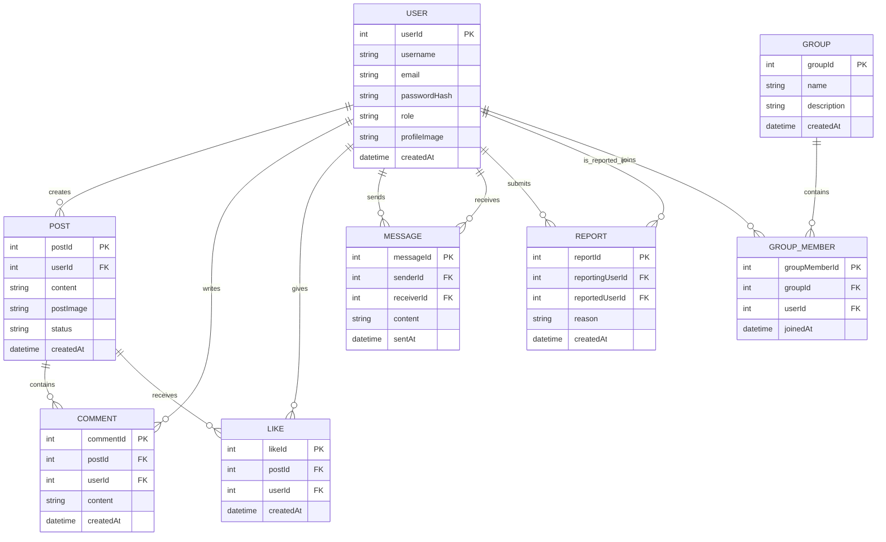

# ProfileBook ER Diagram

## Purpose

This document describes the core data model behind the ProfileBook platform. The project is structured as a social networking application with user accounts, moderated posts, direct messaging, group participation, and user reporting.

## Core Entities

| Entity | Description |
|---|---|
| `User` | Stores account identity, credentials, role, profile image, and account creation details. |
| `Post` | Stores user-generated feed content, uploaded media reference, and moderation status. |
| `Comment` | Stores text comments attached to a post by a user. |
| `Like` | Stores user reactions to posts. |
| `Message` | Stores private messages between two users. |
| `Report` | Stores abuse or misconduct reports raised by one user against another. |
| `Group` | Stores community groups created and managed through the admin workflow. |
| `GroupMember` | Join table representing many-to-many membership between users and groups. |

## Relationship Summary

- One user can create many posts.
- One post can have many comments.
- One post can have many likes.
- One user can send many messages and receive many messages.
- One user can report many users and can also be reported many times.
- One group can contain many users through `GroupMember`.
- One user can join many groups through `GroupMember`.

## Mermaid ER Diagram

## Design Notes

- The schema supports both user-facing and admin-facing workflows.
- `Post.status` enables content moderation by separating submission from approval.
- `Message` requires two foreign keys to the `User` table to support direct conversation history.
- `Report` also depends on two user references to distinguish the reporter from the reported account.
- `GroupMember` acts as a clean association entity for scalable group membership management.

## Business Value

This data model is well suited for a production-style academic or portfolio project because it demonstrates:

- normalized relational design,
- multi-role access control,
- moderation-aware social features,
- extensibility for future analytics or notification modules.
