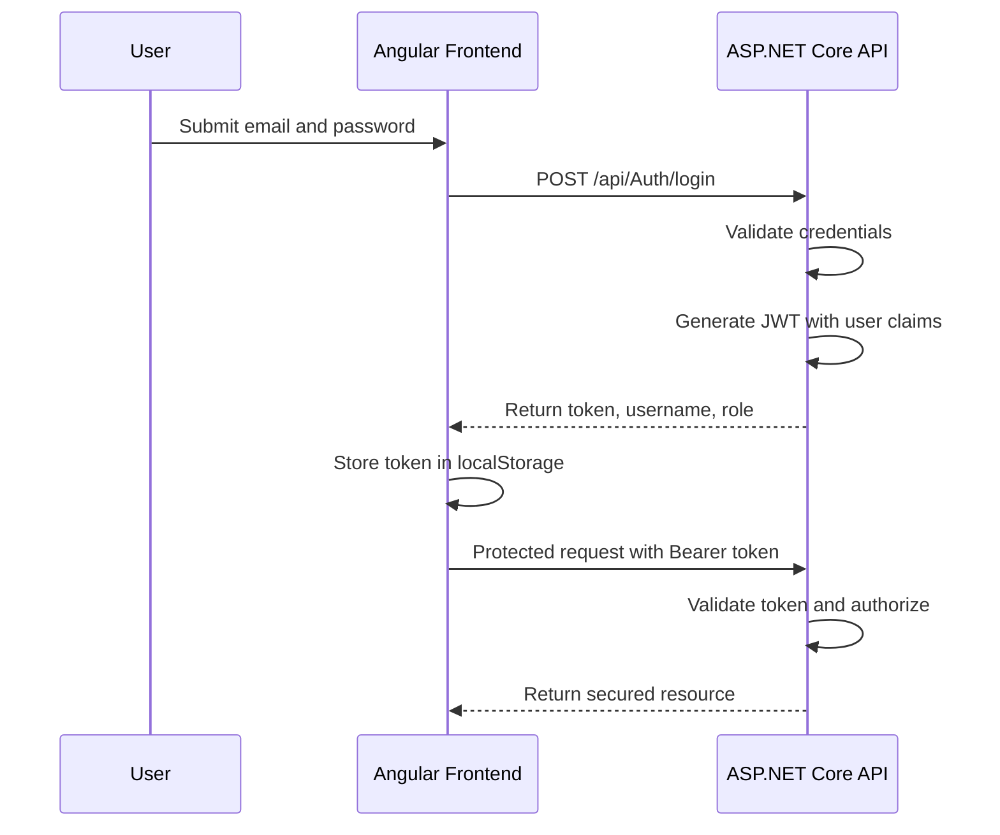

# JWT Authentication

## Overview

ProfileBook uses JSON Web Token authentication to secure API access between the Angular frontend and the ASP.NET Core backend. The implementation is designed for a modern single-page application where the frontend stores the issued token and attaches it to protected requests.

## Authentication Flow



## Frontend Implementation

The Angular client handles authentication through `AuthService`.

### Implemented Responsibilities

- register new users using `POST /api/Auth/register`,
- authenticate existing users using `POST /api/Auth/login`,
- store `token`, `username`, and `role` in `localStorage`,
- expose helper methods such as `isLoggedIn()` and `isAdmin()`,
- clear the stored session on logout.

### Local Storage Keys

| Key | Purpose |
|---|---|
| `token` | JWT bearer token used for authenticated API calls |
| `username` | Logged-in user display identity |
| `role` | Used for client-side role-aware navigation and admin gating |

## Token Usage in API Calls

Protected services build the `Authorization` header in this format:

```http
Authorization: Bearer <jwt-token>
```

This pattern is used in:

- `UserService`
- `PostService`
- `MessageService`
- `GroupService`

## Role-Based Behaviour

The frontend already applies lightweight role-aware behavior:

- admin users are redirected to `/admin` after login,
- standard users are redirected to `/home`,
- the admin page checks `isAdmin()` and redirects non-admin users away,
- authenticated features such as profile, groups, and messaging rely on the stored token.

## Expected Backend Responsibilities

Based on the implemented client and project README, the backend JWT layer is expected to:

- validate the email and password credentials,
- hash and verify passwords securely,
- generate a signed JWT,
- include claims such as `UserId`, `Username`, and `Role`,
- protect secured endpoints with authorization attributes,
- reject missing, invalid, or expired tokens.

## Security Strengths

- Stateless authentication model suitable for SPAs and APIs.
- Clear separation between authentication and feature services.
- Role claim enables straightforward authorization for admin workflows.
- Standard bearer token approach integrates cleanly with ASP.NET Core middleware.

## Current Practical Limitations

- The token is stored in `localStorage`, which is simple and common for student and portfolio projects but less secure than hardened cookie strategies in high-security deployments.
- There is no visible token refresh flow in the frontend.
- Client-side route access is protected by checks in components rather than dedicated Angular route guards.

## Recommended Future Enhancements

- Add Angular route guards for authenticated and admin-only routes.
- Introduce token expiry handling and silent refresh if required.
- Centralize API base URLs through environment configuration.
- Add an Axios interceptor for automatic bearer token injection and 401 handling.
- Consider secure HTTP-only cookies for enterprise-grade hardening.

## Technical Summary

The current JWT authentication design is appropriate for a full-stack academic or freelance delivery because it demonstrates:

- secure login architecture,
- claim-based authorization,
- role-aware UX behavior,
- clean frontend-to-API integration.
